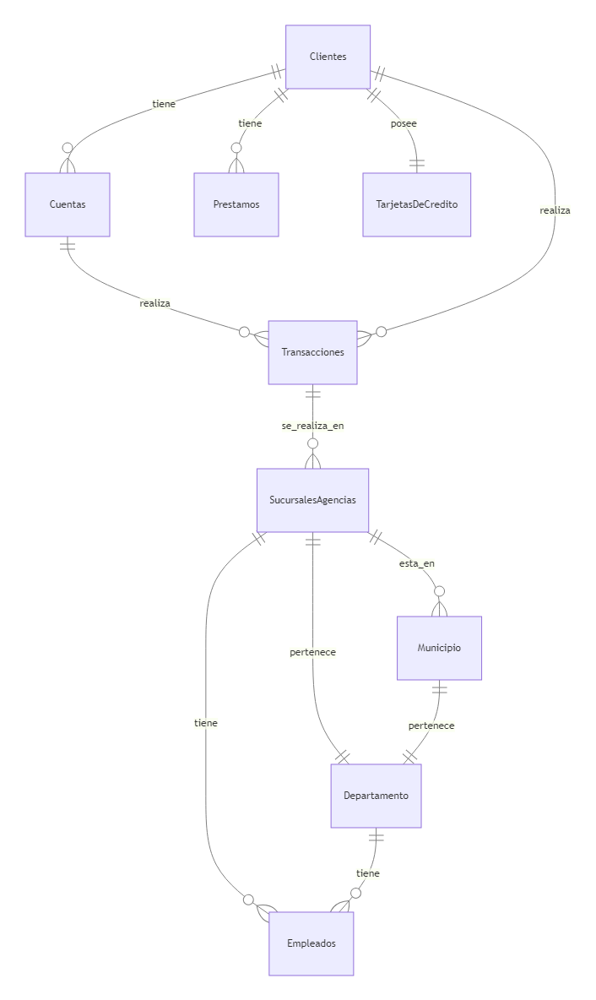
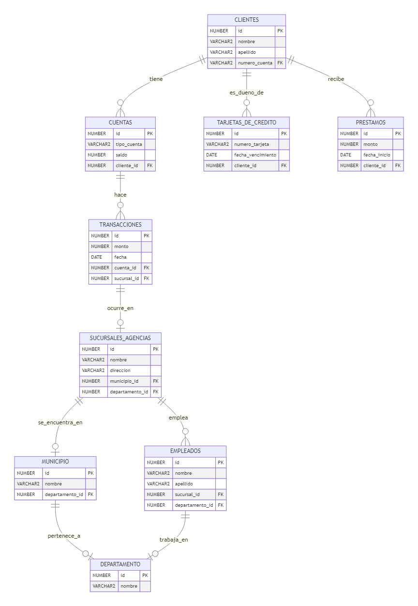

# Sistema Bancario - Banco JP Morgan

## Datos Disponibles
Los siguientes archivos CSV pueden ser descargados en [Google Drive](https://drive.google.com/drive/folders/1XXUqP9MpD8pHrfw-FE-x_7Kv6_l6HKS6), están disponibles para cargar datos en la base de datos:

1. **Clientes** (`clientes_banco_jp_morgan_1m.csv`)
    **Campos**
    1. **ID:** Identificador único del cliente.
    2. **Nombre:** Primer nombre del cliente.
    3. **Apellido:** Apellido del cliente.
    4. **Teléfono:** Número de contacto del cliente

2. **Cuenta**
   1. **Número de Cuenta:** Número de cuenta bancaria del cliente.
   2. **Tipo de Cuenta:** Clasificación del tipo de cuenta bancaria (e.g., corriente, ahorro).
   3. **Saldo:** Monto actual en la cuenta.

3. **Transacciones**(`transacciones_banco_jp_morgan_500k.csv`)
   **Campos**
   1. **ID Transacción**: Identificador único de la transacción.
   2. **ID Cliente**: Identificador único del cliente que realizó la transacción.
   3. **Número de Cuenta**: Número de cuenta del cliente.
   4. **Tipo de Transacción**: Tipo de transacción realizada (Depósito, Retiro, Transferencia, Pago).
   5. **Monto**: Monto de la transacción.
   6. **Fecha**: Fecha en que se realizó la transacción.
   7. **Hora**: Hora en que se realizó la transacción.
   8.  **Descripción**: Breve descripción de la transacción.
   9.  **Sucursal/Agencia**: Sucursal o agencia donde se realizó la transacción.

4. **Préstamos** (`prestamos_banco_jp_morgan_100k.csv`)
    **Campos**
    1. **ID Préstamo**: Identificador único del préstamo.
    2. **ID Cliente**: Identificador único del cliente que recibió el préstamo.
    3. **Monto del Préstamo**: Monto total del préstamo otorgado.
    4. **Tasa de Interés**: Tasa de interés aplicada al préstamo.
    5. **Fecha de Desembolso**: Fecha en que se desembolsó el préstamo.
    6. **Fecha de Vencimiento**: Fecha en que se debe liquidar el préstamo.
    7. **Saldo Pendiente**: Saldo que aún está pendiente de pago.
    8. **Estado del Préstamo**: Estado actual del préstamo (Activo, Vencido, Cancelado).

5. Tarjetas de Crédito (`tarjetas_credito_banco_jp_morgan_100k.csv`)
    **Campos**
    1. **ID Tarjeta**: Identificador único de la tarjeta de crédito.
    2. **ID Cliente**: Identificador único del cliente que posee la tarjeta.
    3. **Número de Tarjeta**: Número de la tarjeta de crédito.
    4. **Límite de Crédito**: Límite máximo de crédito asignado a la tarjeta.
    5. **Saldo Actual**: Saldo actual pendiente en la tarjeta.
    6. **Fecha de Emisión**: Fecha en que se emitió la tarjeta.
    7. **Fecha de Expiración**: Fecha en que expira la tarjeta.
    8. **Estado**: Estado actual de la tarjeta (Activa, Bloqueada, Cancelada).
    9. **Fecha de Corte**: La fecha en que se genera el estado de cuenta de la tarjeta de crédito.
    10. **Día del Ciclo**: El día del mes en que se cierra el ciclo de facturación de la tarjeta de crédito (puede variar entre 1 y 31).

6. Sucursales / Agencias (`sucursales_banco_jp_morgan.csv`)
    **Campos:**

    1. **ID**: Identificador único de la sucursal o agencia.
    2. **Nombre**: Nombre de la sucursal o agencia.
    3. **Tipo**: Especifica si es una sucursal o una agencia.
    4. **Dirección**: Dirección específica de la sucursal o agencia.
    5. **Código Postal**: Código postal del área.
    6. **Teléfono**: Número de contacto de la sucursal o agencia.

7. Departamento
   1. **Departamento**: Departamento en el que se encuentra la sucursal o agencia.
   2. **Municipio**: Municipio correspondiente.

8.  Empleados (`empleados_banco_jp_morgan.csv`)
    **Campos**
    1.  **ID**: Identificador único del empleado.
    2.  **Nombre**: Nombre del empleado.
    3.  **Apellido**: Apellido del empleado.
    4.  **Rol**: El rol o posición del empleado (Ej. Gerente de Sucursal, Asesor Financiero, Cajero, etc.).
    5.  **Departamento**: Departamento al que está asignado el empleado.
    6.  **Sucursal/Asignación**: La sucursal o agencia a la que está asignado el empleado.
    7.  **Teléfono**: Número de contacto del empleado.
    8.  **Fecha de Contratación**: La fecha en que el empleado fue contratado.
    9.  **Salario**: El salario del empleado.
    10. **Horario de Trabajo**: Horario en el que el empleado trabaja.

### Análisis de los datos de los archivos CSV que pueden ser convertidos en tablas

| Tablas                 | Clientes | Cuentas | Transacciones | Tarjetas de crédito | Sucursales/Agencias | Departamento | Empleados | Municipio | Préstamos |
|------------------------|----------|---------|---------------|---------------------|---------------------|--------------|-----------|-----------|-----------|
| **Clientes**            | ————     | 1:N     | 1:N           | 1                   | No Aplica            | No Aplica     | No Aplica | No aplica | 1:N       |
| **Cuentas**             | N:1      | ————    | 1:N           | No aplica            | No Aplica            | No Aplica     | No Aplica | No aplica | No aplica |
| **Transacciones**       | N:1      | N:1     | ————          | No aplica            | 1                   | No Aplica     | No Aplica | No aplica | No aplica |
| **Tarjetas de crédito** | N:1      | No aplica| No aplica      | ————                | No Aplica            | No Aplica     | No Aplica | No aplica | No aplica |
| **Sucursales/Agencias** | No aplica| No aplica| 1:N           | No aplica            | ————                 | 1:1          | 1:N       | No aplica | No aplica |
| **Departamento**        | No aplica| No aplica| No aplica      | No aplica            | 1:1                 | ————         | N:1       | No aplica | No aplica |
| **Empleados**           | No aplica| No aplica| No aplica      | No aplica            | N:1                 | N:1          | ————      | No aplica | No aplica |
| **Municipio**           | No aplica| No aplica| No aplica      | No aplica            | 1:N                 | 1:1          | No aplica | ————      | No aplica |
| **Préstamos**           | 1:1      | No aplica| No aplica      | No aplica            | No aplica            | No aplica     | No aplica | No aplica | ————      |

### Diagrama Entidad-Relación Conceptual

### Diagrama Lógico Entidad-Relación
